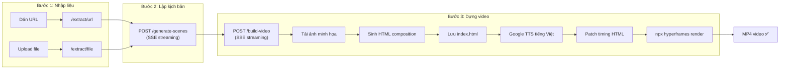

# TechBeat — Tổng Quan Dự Án

> **Tên dự án**: TechBeat (DailyByte-News)
> **Mục tiêu**: Biến tin tức công nghệ (URL, PDF, DOCX, PPTX) thành video tóm tắt tiếng Việt hoàn chỉnh (MP4) chỉ trong vài phút, hoàn toàn tự động.

---

## 🎯 Ý Tưởng Cốt Lõi

TechBeat là một ứng dụng web **end-to-end** giải quyết bài toán:

```
📰 Nội dung thô (link bài viết, tài liệu)
    → 🧠 AI phân tích & viết kịch bản tiếng Việt
    → 🎨 Sinh HTML composition (video layout + animation)
    → 🎙️ Text-to-Speech tiếng Việt
    → 🎬 Render ra MP4 sẵn sàng đăng
```

**Đối tượng sử dụng**: Content creator, team marketing, news aggregator muốn tạo video bản tin công nghệ hằng ngày mà không cần kỹ năng edit video.

---

## 🏗️ Kiến Trúc Tổng Thể

Dự án gồm **3 thành phần chính** (monorepo cùng thư mục gốc):

| Thành phần | Thư mục | Công nghệ | Vai trò |
|---|---|---|---|
| **Frontend** | `app/` | Next.js 16 + React 19 + Tailwind v4 + TypeScript | Giao diện người dùng, wizard 3 bước |
| **Backend** | `backend/` | FastAPI (Python 3.11+) | API xử lý: trích xuất nội dung, gọi LLM, TTS, render |
| **Video Project** | `my-video/` | HyperFrames (HTML5 + GSAP) | Template composition, output render MP4 |

```
D:\AI_Video_Edit\
├── app/              # Frontend Next.js
├── backend/          # Backend FastAPI  
├── my-video/         # HyperFrames video project
├── .agents/skills/   # AI Agent skills (HyperFrames patterns)
├── docs/             # Tài liệu dự án (thư mục này)
└── .gitignore
```

---

## 🔄 Luồng Hoạt Động (Pipeline)



### Chi tiết từng bước:

1. **Trích xuất nội dung**: Từ URL (BeautifulSoup), PDF (OCR qua LLM vision + pypdf fallback), DOCX, PPTX
2. **Sinh kịch bản**: LLM (GPT-5.1 / Claude) phân tích nội dung → tạo ScenePlan JSON (4-8 scene, mỗi scene 8-20s)
3. **Chọn ảnh minh họa** (tuỳ chọn): DuckDuckGo image search → người dùng chọn ảnh cho mỗi scene
4. **Build video pipeline**:
   - Tải ảnh minh họa đã chọn về `my-video/assets/`
   - Claude Sonnet 4.6 sinh HTML composition (HyperFrames format)
   - Ghi vào `my-video/index.html`
   - Google TTS sinh giọng đọc tiếng Việt cho mỗi scene → `assets/pN.wav`
   - Patch timing trong HTML cho khớp với audio thực tế
   - `npx hyperframes render` → MP4

---

## 🛠️ Cách Chạy Dự Án

### Yêu cầu:
- Node.js 18+
- Python 3.11+
- FFmpeg (cho render video)
- Chrome/Chromium (cho headless render)

### Backend:
```bash
cd backend
conda activate aieditor
pip install -r requirements.txt
# Tạo .env từ .env.example, điền OPENAI_API_KEY
uvicorn main:app --reload --port 8000
```

### Frontend:
```bash
cd app
npm install
# Tạo .env.local (NEXT_PUBLIC_API_URL=http://localhost:8000)
npm run dev  # → http://localhost:3000
```

### Preview/Render video:
```bash
cd my-video
npm run dev     # Preview trong browser
npm run render  # Render ra MP4
```

---

## 🔑 Biến Môi Trường Quan Trọng

### Backend (`backend/.env`):
| Biến | Mô tả | Mặc định |
|---|---|---|
| `OPENAI_API_KEY` | API key cho LLM | (bắt buộc) |
| `OPENAI_BASE_URL` | Base URL API | `https://api.pinkyne.com/v1` |
| `OPENAI_SCENES_MODEL` | Model sinh kịch bản | `gpt-5.1` |
| `OPENAI_COMPOSITION_MODEL` | Model sinh HTML composition | `claude-sonnet-4-6` |
| `HYPERFRAMES_PROJECT` | Đường dẫn tuyệt đối đến my-video | `D:\AI_Video_Edit\my-video` |
| `TTS_LANG` | Ngôn ngữ TTS | `vi` |

### Frontend (`app/.env.local`):
| Biến | Mô tả | Mặc định |
|---|---|---|
| `NEXT_PUBLIC_API_URL` | URL backend | `http://localhost:8000` |
