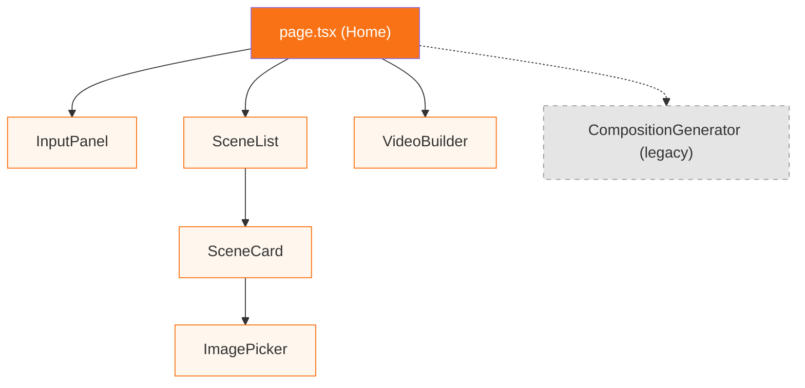

# Kiến Trúc Frontend Chi Tiết

---

## 🎨 Design System

### Bảng Màu (Color Palette)

| Token | Hex | Sử dụng |
|---|---|---|
| `--background` | `#fff7ed` | Body background (cream/kem nhạt) |
| `--foreground` | `#1c1917` | Text color (stone-900) |
| Orange-500 | `#f97316` | Primary accent, buttons, links |
| Orange-600 | `#ea580c` | Gradient start, hover states |
| Orange-400 | `#fb923c` | Gradient end, lighter accent |
| Orange-200 | `#fed7aa` | Borders, dividers |
| Orange-100 | `#ffedd5` | Badge backgrounds, hover fills |
| Stone-900 | `#1c1917` | Headings |
| Stone-600 | `#57534e` | Secondary text |
| Stone-400 | `#a8a29e` | Muted text, placeholders |

### Typography

| Element | Font | Weight | Size |
|---|---|---|---|
| Body | Be Vietnam Pro | 400 | 16px (default) |
| Headings | Be Vietnam Pro | 700-800 | 2xl-6xl |
| Code/Mono | JetBrains Mono | 400 | 11-13px |
| Labels | Be Vietnam Pro | 700 | 10-11px, uppercase tracking-wider |

### CSS Utility Classes

```css
/* Glassmorphism cards */
.glass          /* bg: rgba(255,255,255,0.65), blur: 20px, saturate: 160% */
.glass-strong   /* bg: rgba(255,255,255,0.85), blur: 24px, saturate: 180% */

/* Animated gradient text */
.gradient-text  /* Gradient: #ea580c → #f97316 → #fb923c, animated 6s */

/* Glow button */
.btn-glow       /* Gradient bg, orange glow shadow, hover lift -1px */

/* Mesh gradient background */
.mesh-bg        /* Fixed position, 2 radial gradients, 18s float animation */

/* Shimmer skeleton loading */
.shimmer        /* Orange gradient sweep, 2s linear infinite */

/* Entry animation */
.fade-up        /* 0.5s: translateY(12px) + opacity 0 → normal */

/* Pulse ring indicator */
.pulse-ring     /* 1.6s pulsing border ring animation */
```

### Selection & Scrollbar
- Text selection: `rgba(249, 115, 22, 0.3)` orange tint
- Scrollbar: 10px, transparent track, orange-30% thumb

---

## 🧩 Component Architecture



### State Flow

```
                    ┌─────────────────────┐
                    │                     │
     ┌──────┐   handleExtracted()   ┌────────────┐
     │input │ ──────────────────── → │ generating │
     └──┬───┘                        └─────┬──────┘
        ↑                                  │
   handleReset()                    SSE done event
        │                                  │
     ┌──┴───┐    setStage("build")   ┌─────▼──────┐
     │build │ ← ──────────────────── │  preview   │
     └──────┘                        └────────────┘
```

### Data Flow

```
ExtractedContent → generateScenes() → ScenePlan → 
  ├── SceneList (view/edit/reorder)
  │   └── SceneCard (edit narration, duration, image)
  │       └── ImagePicker (search & select image)
  └── VideoBuilder (build pipeline)
      └── POST /build-video → SSE events → MP4
```

---

## 📡 API Communication Patterns

### Tất cả API calls follow cùng pattern:

```typescript
// 1. Environment variable
const API = process.env.NEXT_PUBLIC_API_URL ?? "http://localhost:8000";

// 2. AbortController cho cancellation
const abort = new AbortController();
abortRef.current = abort;

// 3. Fetch with signal
const res = await fetch(`${API}/endpoint`, {
  method: "POST",
  headers: { "Content-Type": "application/json" },
  body: JSON.stringify(payload),
  signal: abort.signal,
});

// 4. SSE stream parsing
const reader = res.body!.getReader();
const decoder = new TextDecoder();
let buf = "";

while (true) {
  const { done, value } = await reader.read();
  if (done) { processLines(buf); break; }
  buf += decoder.decode(value, { stream: true });
  const split = buf.split("\n\n");
  buf = split.pop() ?? "";
  processLines(split.join("\n\n") + "\n\n");
}

// 5. Cancel on unmount or user action
abortRef.current?.abort();
```

### Error handling (tiếng Việt)
```typescript
catch (err) {
  if ((err as Error).name === "AbortError") return; // User cancelled
  setError(err instanceof Error ? err.message : "Tạo kịch bản thất bại");
}
```

---

## 🖼️ ImagePicker — Luồng Hoạt Động

1. User click "🖼 Ảnh" hoặc click vào thumbnail trên SceneCard
2. Modal mở với `initialQuery = scene.imageQuery || scene.title`
3. Auto-search khi mở (nếu có query)
4. Grid 3x4 thumbnails từ DuckDuckGo
5. Click chọn → `onPick(imageUrl)` → update `scene.imageUrl`
6. Build pipeline sẽ tải ảnh về `assets/sceneN.jpg` khi build

---

## 🏗️ VideoBuilder — 4-Stage Pipeline UI

```
┌─────────────┐  ┌─────────────┐  ┌─────────────┐  ┌─────────────┐
│ 🎨 Stage 1  │  │ 💾 Stage 2  │  │ 🎙️ Stage 3  │  │ 🎬 Stage 4  │
│ Composition  │→│   Save      │→│    TTS      │→│   Render    │
│              │  │             │  │             │  │             │
│ pending      │  │ pending     │  │ pending     │  │ pending     │
│ active       │  │ active      │  │ active      │  │ active      │
│ done ✓       │  │ done ✓      │  │ done ✓      │  │ done ✓      │
│ error !      │  │ error !     │  │ error !     │  │ error !     │
└─────────────┘  └─────────────┘  └─────────────┘  └─────────────┘
```

- **active** stage: gradient background + ring + ping animation
- **done** stage: orange-50 background + checkmark
- **error** stage: red-50 background + exclamation
- Render stage: progress bar (from log `N%` regex) + terminal-style log viewer
- After done: video player + download/open buttons + file path
