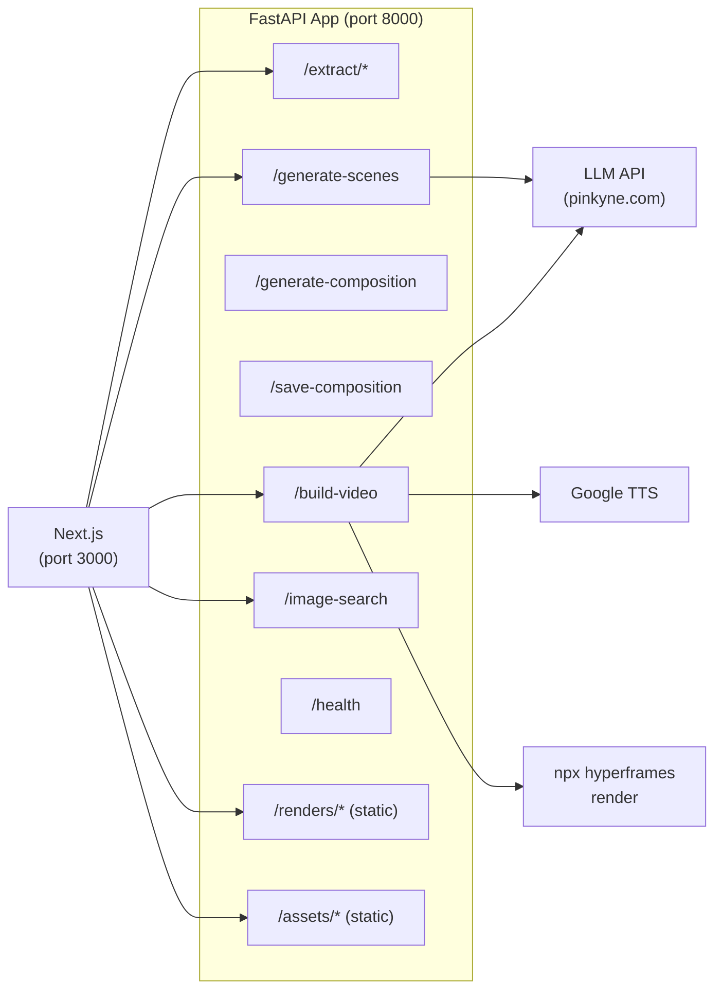

# Kiến Trúc Backend Chi Tiết

---

## 🏛️ Tổng Quan

Backend là một **FastAPI application** đóng vai trò:
1. **Content extraction engine** — trích xuất text từ nhiều nguồn
2. **AI orchestrator** — điều phối LLM calls cho scene planning & composition generation
3. **Build pipeline** — TTS, HTML patching, render orchestration
4. **Image proxy** — DuckDuckGo image search
5. **Static file server** — serve rendered videos & assets

---

## 📡 Router Map



---

## 🔌 API Endpoints Chi Tiết

### `POST /extract/url`
**Input**: `{ "url": "https://..." }`
**Output**: `{ "title": "...", "text": "...", "source": "..." }`

Luồng xử lý:
1. `httpx.AsyncClient.get(url)` với User-Agent giả lập browser
2. BeautifulSoup parse HTML, loại bỏ noise tags (script, style, nav, footer, header, aside, iframe, noscript)
3. Lấy title từ: `og:title` → `<title>` → `<h1>` → "Untitled"
4. Lấy text từ: `<main>` → `<article>` → `[role=main]` → `.content` → `.post` → `<body>`
5. Giới hạn 20,000 ký tự

### `POST /extract/file`
**Input**: `multipart/form-data` with `file` field
**Supported**: `.pdf`, `.docx`, `.pptx`
**Output**: `{ "title": "...", "text": "...", "source": "..." }`

Luồng xử lý theo file type:
- **PDF**: OCR (ưu tiên) → pypdf fallback
  - OCR: PyMuPDF rasterize PDF pages → PNG → base64 → multimodal LLM vision call
  - Fallback: pypdf text extraction (khi OCR trả về < 30 chars)
- **DOCX**: python-docx, lấy all paragraph text
- **PPTX**: python-pptx, iterate slides → shapes → text frames → runs

### `POST /generate-scenes` (SSE)
**Input**: `{ "content": "...", "title": "..." }`
**Output**: Server-Sent Events stream

System prompt yêu cầu LLM:
- Phân tích nội dung
- Tạo 4-8 scenes
- Mỗi scene 8-20 giây
- Narration tiếng Việt
- imageQuery tiếng Anh

LLM response được stream chunk-by-chunk, cuối cùng extract JSON bằng regex `\{[\s\S]*\}`.

### `GET /image-search`
**Params**: `q` (query), `limit` (default 12), `safe` (default true)
**Output**: `{ "query": "...", "count": N, "results": [...] }`

Luồng xử lý (DuckDuckGo scraping, không cần API key):
1. GET `https://duckduckgo.com/?q=...&iax=images&ia=images` → extract `vqd` token
2. GET `https://duckduckgo.com/i.js?q=...&vqd=...` → JSON results
3. Map results to `{ image, thumbnail, title, source, url, width, height }`

### `POST /build-video` (SSE)
**Input**: ScenePlan JSON (title, scenes[], totalDuration)
**Output**: SSE stream of pipeline events → final MP4

Chi tiết pipeline: xem [Build Pipeline](#-build-pipeline-chi-tiết) bên dưới.

---

## 🔧 LLM Configuration Module (`routers/llm.py`)

```python
# Singleton pattern — khởi tạo 1 lần
_client: OpenAI | None = None
_async_client: AsyncOpenAI | None = None

# Config từ env vars
api_key = os.getenv("OPENAI_API_KEY")         # Bắt buộc
base_url = os.getenv("OPENAI_BASE_URL")        # Default: pinkyne.com
```

### Model selector:
```python
def get_model(kind: str) -> str:
    "scenes"      → OPENAI_SCENES_MODEL      or OPENAI_MODEL or "gpt-5.5-pro"
    "composition" → OPENAI_COMPOSITION_MODEL  or OPENAI_MODEL or "gpt-5.5-pro"
    default       → OPENAI_MODEL              or "gpt-5.5-pro"
```

> **Lưu ý**: Dùng OpenAI-compatible API SDK nên có thể point đến bất kỳ provider nào (OpenAI, Anthropic via proxy, local models, etc.)

---

## 🏗️ Build Pipeline Chi Tiết

### Stage 0: Download Images (internal)
```python
async with httpx.AsyncClient(timeout=20.0, follow_redirects=True) as http:
    for scene in scenes:
        if scene.imageUrl:
            resp = await http.get(scene.imageUrl, headers={...})
            local_path = assets_dir / f"scene{N}.jpg"
            local_path.write_bytes(resp.content)
            scene.imageAsset = f"assets/scene{N}.jpg"
```
- Detect extension từ URL (.png, .webp, .jpeg, .jpg, .gif)
- Headers: `User-Agent: Mozilla/5.0`, `Referer: https://duckduckgo.com/`
- Skip silently on error (print warning, continue)

### Stage 1: Composition Generation
- Reuse `stream_composition_events()` từ `compositions.py`
- Emit SSE progress events mỗi ~500 chars
- Validate:
  - `<html` tag present
  - `</html>` closing tag present
  - `window.__timelines` registration present

### Stage 2: Save
- `project_root / "index.html"` — ghi HTML ra file
- UTF-8 encoding

### Stage 3: TTS
```python
async def synthesize_tts(text: str, target: Path):
    # gTTS sinh MP3 → pydub convert sang WAV
    # Fallback: nếu pydub fail, giữ MP3 (HyperFrames chấp nhận cả hai)
    gTTS(text=text, lang="vi", slow=False).write_to_fp(mp3_buf)
    AudioSegment.from_file(mp3_buf, format="mp3").export(target, format="wav")
```

### Stage 3.5: Timing Patch
Sau TTS, **patch HTML** để sync timing:

```python
def patch_html_timing(html: str, durations: list[float]) -> str:
    # 1. Tính scene durations: ceil(audio_duration) + 1s buffer
    # 2. Tính cumulative start times
    # 3. Regex patch <audio> tags: data-start, data-duration
    # 4. Regex patch root data-duration
    # 5. Inject JS script rebuild GSAP timeline
```

Script inject:
- Tạo timeline mới với timing chính xác
- Fade in/out mỗi scene tại đúng timestamp
- Animate children (badge, title, subtitle, desc, visual)
- Đăng ký lại `window.__timelines["main"]`

### Stage 4: Render
```python
async def run_render(project_root: Path, on_log):
    # Windows: ["npx.cmd", "--yes", "hyperframes@0.6.20", "render"]
    # Linux:   ["npx", "--yes", "hyperframes@0.6.20", "render"]
    
    # subprocess.Popen trong thread riêng
    # Log lines → asyncio.Queue → SSE stream
    # Return: newest .mp4 file in renders/ directory
```

**Lý do dùng thread**: Windows uvicorn dùng selector event loop, không hỗ trợ `asyncio.create_subprocess_exec`. Phải dùng `subprocess.Popen` + `threading` + `asyncio.Queue`.

---

## 📁 Content Extractors

### URL Extractor (`extractors/url.py`)
| Bước | Chi tiết |
|---|---|
| HTTP Client | `httpx.AsyncClient`, timeout=15s, follow_redirects=True |
| HTML Parser | BeautifulSoup, `html.parser` |
| Noise Removal | Remove: script, style, nav, footer, header, aside, iframe, noscript |
| Title Priority | og:title → `<title>` → `<h1>` → "Untitled" |
| Text Priority | main → article → [role=main] → .content → .post → body |
| Limit | 20,000 chars |

### OCR Extractor (`extractors/ocr.py`)
| Bước | Chi tiết |
|---|---|
| Render | PyMuPDF (`fitz`) — DPI 144, max 30 pages |
| Format | PNG bytes per page |
| LLM Call | Multimodal request: text prompt + base64 images |
| Model | `OPENAI_OCR_MODEL` or `OPENAI_COMPOSITION_MODEL` or `claude-sonnet-4-6` |
| Prompt | "Transcribe every page in reading order as Markdown..." |
| Temperature | 0.1 (low creativity for faithful transcription) |

### PDF Extractor (`extractors/pdf.py`)
| Step | Detail |
|---|---|
| Primary | OCR via vision LLM |
| Fallback | pypdf text extraction (when OCR < 30 chars) |
| Title | Filename with extension removed, dashes/underscores → spaces |

---

## ⚡ SSE Event Format

### Helper function
```python
def sse(data: dict) -> str:
    return f"data: {json.dumps(data, ensure_ascii=False)}\n\n"
```

### Build pipeline events timeline:
```
data: {"type":"stage","stage":"composition","status":"start","message":"Đang sinh..."}
data: {"type":"stage","stage":"composition","status":"progress","chars":1500}
data: {"type":"stage","stage":"composition","status":"progress","chars":3000}
data: {"type":"stage","stage":"composition","status":"done"}
data: {"type":"stage","stage":"save","status":"start","message":"Đang lưu..."}
data: {"type":"stage","stage":"save","status":"done","path":"D:\\...\\index.html"}
data: {"type":"stage","stage":"tts","status":"start","message":"Đang sinh giọng đọc..."}
data: {"type":"stage","stage":"tts","status":"progress","scene":1,"of":6}
data: {"type":"stage","stage":"tts","status":"progress","scene":2,"of":6}
...
data: {"type":"stage","stage":"tts","status":"done"}
data: {"type":"stage","stage":"render","status":"start","message":"Đang render..."}
data: {"type":"stage","stage":"render","status":"log","line":"[render] Capturing frame 30/900..."}
data: {"type":"stage","stage":"render","status":"log","line":"Progress: 45%"}
...
data: {"type":"done","videoUrl":"/renders/main.mp4","videoPath":"D:\\...\\renders\\main.mp4"}
```
