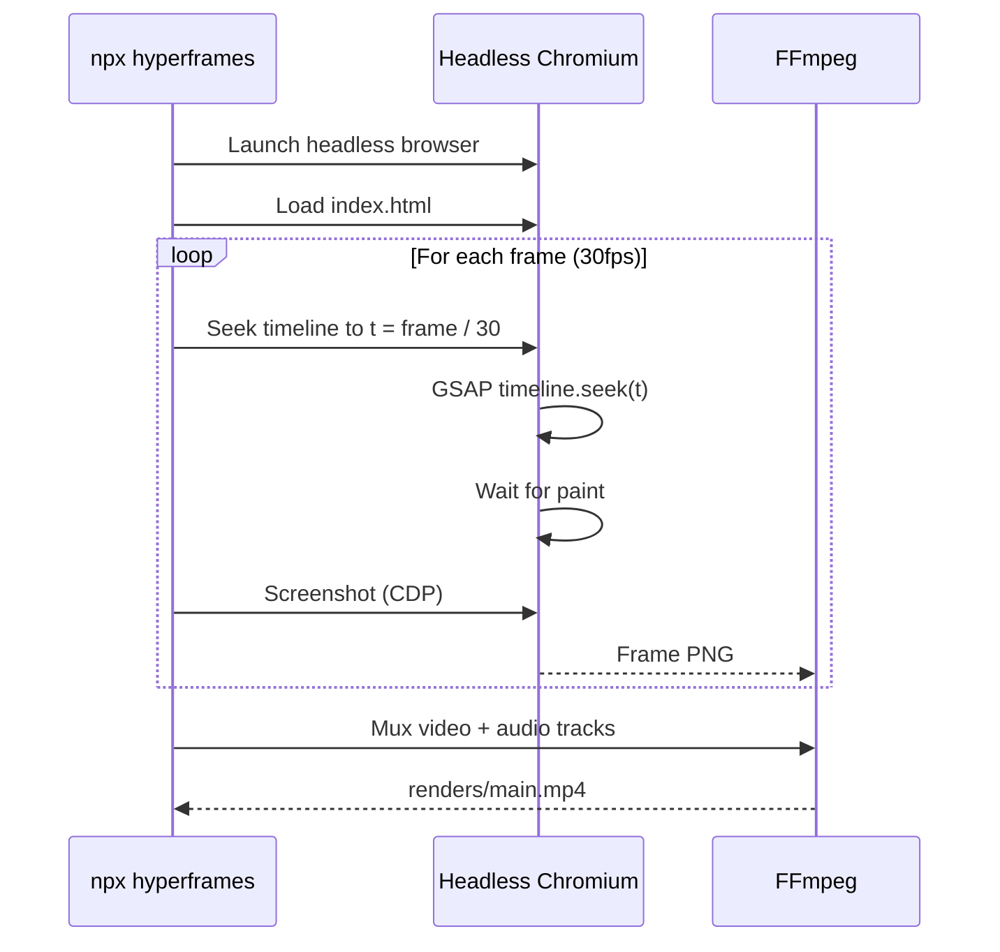

# HyperFrames & Video Composition Rules

Tài liệu này tổng hợp tất cả quy tắc liên quan đến HyperFrames video framework — công nghệ core để sinh và render video trong dự án TechBeat.

---

## 🎯 HyperFrames Là Gì?

HyperFrames biến **trình duyệt Chromium thành engine render video**:
- Composition là file HTML thuần (HTML + CSS + JS)
- Animation qua GSAP timeline (deterministic)
- Render bằng headless Chromium: tua timeline → chụp frame → FFmpeg ghép

**Ưu điểm**: Pixel-perfect, deterministic, AI-friendly (dễ sinh bởi LLM).

---

## 📐 Cấu Trúc HTML Composition

### Root Element (bắt buộc)
```html
<!doctype html>
<html lang="vi">
<head>
  <meta charset="utf-8">
  <link href="https://fonts.googleapis.com/css2?family=Be+Vietnam+Pro:wght@300;400;500;600;700;800&display=swap" rel="stylesheet">
  <script src="https://cdn.jsdelivr.net/npm/gsap@3.14.2/dist/gsap.min.js"></script>
  <style>/* ... */</style>
</head>
<body>
  <div id="root"
       data-composition-id="main"
       data-start="0"
       data-width="1920"
       data-height="1080"
       data-duration="{TOTAL_SECONDS}">
    
    <!-- Scenes here -->
    
    <!-- Audio elements at the end -->
    <audio id="v1" src="assets/p1.wav" data-start="0" data-duration="12" data-volume="1"></audio>
    <audio id="v2" src="assets/p2.wav" data-start="12" data-duration="10" data-volume="1"></audio>
    <!-- ... -->
  </div>
  
  <script>/* GSAP timeline */</script>
</body>
</html>
```

### Scene Element
```html
<div class="scene" id="scene1"
     style="position:absolute; width:100%; height:100%; opacity:0; visibility:hidden;">
  
  <div class="scene-container" style="display:grid; grid-template-columns:1fr 1fr; gap:80px; max-width:1600px; padding:60px; margin:0 auto;">
    
    <!-- Info Column -->
    <div class="info-col">
      <div id="s1-badge" class="scene-badge">Phần 1</div>
      <h1 id="s1-title" class="scene-title">Tiêu đề phân cảnh</h1>
      <h2 id="s1-subtitle" class="scene-subtitle">Phụ đề cam</h2>
      <p id="s1-desc" class="scene-description">Mô tả nội dung...</p>
    </div>
    
    <!-- Visual Column -->
    <div class="visual-col">
      <!-- Nếu có ảnh minh họa: -->
      
      <!-- Nếu không có ảnh: mock visual phù hợp nội dung -->
    </div>
    
  </div>
</div>
```

---

## 🎭 GSAP Timeline Pattern

### Khởi tạo (bắt buộc)
```javascript
(function() {
  const tl = gsap.timeline({ paused: true });  // PHẢI paused
  
  // ... scene animations ...
  
  // PHẢI đăng ký (thiếu = render trống)
  window.__timelines = window.__timelines || {};
  window.__timelines["main"] = tl;
})();
```

### Scene Animation Template
```javascript
// Scene N: start=S giây, duration=D giây
const S = 0;   // cumulative start time
const D = 12;  // scene duration

// 1. Show scene
tl.set("#scene1", { opacity: 0, visibility: "visible" }, S);
tl.to("#scene1",  { opacity: 1, duration: 0.6, ease: "power3.out" }, S);

// 2. Animate children (staggered)
tl.from("#s1-badge",    { y: -20, opacity: 0, duration: 0.5, ease: "back.out(1.7)" },    S + 0.3);
tl.from("#s1-title",    { y: 40,  opacity: 0, duration: 0.7, ease: "power4.out" },        S + 0.5);
tl.from("#s1-subtitle", { y: 30,  opacity: 0, duration: 0.6, ease: "power3.out" },        S + 0.7);
tl.from("#s1-desc",     { y: 20,  opacity: 0, duration: 0.5, ease: "power2.out" },        S + 0.9);

// 3. Animate visual column
tl.from("#scene1 .visual-col > *", {
  scale: 0.9, opacity: 0, duration: 0.7,
  stagger: 0.15, ease: "back.out(1.5)"
}, S + 0.5);

// 4. Fade out (0.6s trước khi scene kết thúc)
tl.to("#scene1",  { opacity: 0, duration: 0.5, ease: "power2.in" }, S + D - 0.6);
tl.set("#scene1", { visibility: "hidden" }, S + D);
```

### Timing Rules
| Rule | Detail |
|---|---|
| Scene start | Tích luỹ: scene N start = sum(duration of scenes 0..N-1) |
| Fade in | 0.6s tại start |
| Content stagger | Badge +0.3s, Title +0.5s, Subtitle +0.7s, Desc +0.9s |
| Fade out | 0.5s, bắt đầu tại `start + duration - 0.6` |
| Hide | `set visibility: hidden` tại `start + duration` |

---

## 🎨 Style Guide cho Composition

### Color Palette (nền cam ấm)
```css
:root {
  /* Background gradients */
  --bg-dark: #1a0f08;
  --bg-medium: #2d1810;
  
  /* Accent colors */
  --accent-dark: #f97316;   /* cam đậm */
  --accent-mid: #fb923c;    /* cam sáng */
  --accent-light: #fdba74;  /* cam nhạt */
  
  /* Text */
  --text-light: #fff7ed;
  
  /* Glow */
  --glow: rgba(249, 115, 22, 0.15);
}
```

### Layout Constants
| Property | Value |
|---|---|
| Resolution | 1920 × 1080 (16:9) |
| Max width | 1600px |
| Padding | 60px |
| Grid gap | 80px |
| Grid columns | 1fr 1fr |
| Border radius | 24px (cards, images) |
| Title size | 4.5rem |
| Subtitle size | 2.2rem |
| Body size | 1.3rem |

### Scene Image Style
```css
.scene-image {
  width: 640px;
  height: 420px;
  object-fit: cover;
  border-radius: 24px;
  box-shadow: 0 20px 60px -12px rgba(249, 115, 22, 0.3);
}
```

---

## 🔊 Audio Rules

### File naming convention
| File | Nội dung |
|---|---|
| `assets/p1.wav` | TTS narration scene 1 |
| `assets/p2.wav` | TTS narration scene 2 |
| `assets/vN.wav` | Alternative voice files |

### Audio element (trong HTML)
```html
<audio id="v1" src="assets/p1.wav"
       data-start="0"
       data-duration="12"
       data-volume="1">
</audio>
```

- `id="vN"` — N = scene number
- `data-start` — start time in seconds (patched by pipeline)
- `data-duration` — duration in seconds (patched by pipeline)
- `data-volume` — 0.0 to 1.0
- Đặt **sau cùng** trong `#root`, trước closing `</div>`

---

## ⚡ Render Process

```
npx hyperframes render
```

Quá trình render:



### Key points:
- **30 FPS** mặc định
- Mỗi frame: timeline seek → paint → capture → pipe to FFmpeg
- Audio tracks ghép theo `data-start` / `data-duration` attributes
- Output: `my-video/renders/main.mp4`

---

## ✅ Validation Checklist

Trước khi render, verify:

- [ ] Root có `data-composition-id="main"`
- [ ] Root có `data-duration` đúng (tổng tất cả scenes)
- [ ] Root có `data-width="1920"` và `data-height="1080"`
- [ ] Mỗi scene có `id="sceneN"` unique
- [ ] Mỗi scene ban đầu `opacity: 0; visibility: hidden`
- [ ] `window.__timelines["main"]` được đăng ký
- [ ] Timeline `paused: true`
- [ ] Mỗi audio tag có đúng `data-start` / `data-duration`
- [ ] Audio file paths đúng (`assets/pN.wav`)
- [ ] Không có `setTimeout`, `setInterval`, `requestAnimationFrame`
- [ ] Không có `Math.random()`, `Date.now()`, `fetch()`
- [ ] Font Google Fonts load đúng (Be Vietnam Pro, Vietnamese subset)
- [ ] Text content bằng tiếng Việt có dấu

---

## 🛠️ CLI Commands

```bash
# Trong thư mục my-video/:
npm run dev       # Preview server (long-running, giữ chạy background)
npm run check     # lint + validate + inspect
npm run render    # Render → renders/main.mp4
npm run publish   # Publish & get shareable link

# HyperFrames CLI trực tiếp:
npx hyperframes lint --verbose     # Chi tiết lint
npx hyperframes lint --json        # JSON output cho CI
npx hyperframes docs <topic>       # Docs reference
# Topics: data-attributes, gsap, compositions, rendering, examples, troubleshooting
```

> ⚠️ `npm run dev` là server chạy liên tục. Không chạy foreground — sẽ bị timeout.
