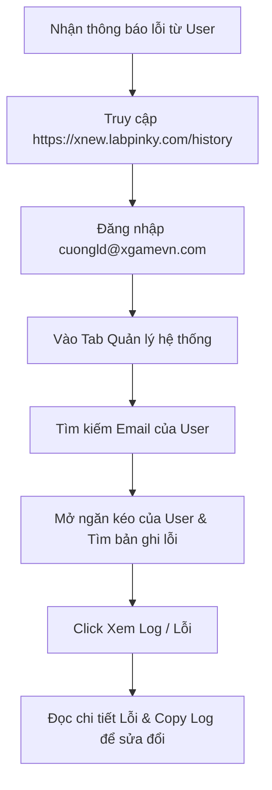

# Hướng dẫn sử dụng: Bảng Quản trị & Giám sát Lịch sử (Admin Dashboard)

Tài liệu này hướng dẫn chi tiết cách sử dụng các tính năng của trang Quản trị (Admin) trên hệ thống **TechBeat AI News Studio** dành riêng cho tài khoản quản trị viên.

---

## 1. Cách truy cập Giao diện Admin

1. Truy cập vào trang web sản xuất: **[https://xnew.labpinky.com/history](https://xnew.labpinky.com/history)** (hoặc click vào nút **Lịch sử** ở trang chủ).
2. Tiến hành đăng nhập bằng tài khoản Gmail của quản trị viên: **`cuongld@xgamevn.com`**.
3. Sau khi đăng nhập thành công, bạn sẽ thấy xuất hiện thêm thanh điều hướng gồm 2 tab:
   * **Lịch sử của tôi**: Hiển thị danh sách video và HTML do chính bạn tạo.
   * **Quản lý hệ thống (Admin)**: Mở giao diện giám sát và quản lý lịch sử của toàn bộ người dùng khác trên hệ thống.

> [!NOTE]
> Phân quyền Admin được cấu hình cứng với email `cuongld@xgamevn.com`. Các tài khoản thông thường sẽ không nhìn thấy tab quản trị này và không có quyền truy cập vào các API quản trị.

---

## 2. Các tính năng chính của Giao diện Admin

Tại tab **Quản lý hệ thống (Admin)**, bạn có thể thực hiện các công việc giám sát và xử lý lỗi như sau:

### 2.1. Phân chia thư mục người dùng (Chia ngăn)
* Toàn bộ người dùng đã từng tạo video trên hệ thống được phân chia thành các **ngăn kéo riêng biệt (Collapsible Accordions)**.
* **Thời gian tạo ngăn**: Hiển thị ngày giờ thư mục của người dùng đó được khởi tạo trên server.
* **Chỉ số thống kê nhanh (Stats)**: Trên mỗi ngăn thẻ của user hiển thị số lượng:
  * **Tổng**: Tổng số lượt chạy/dựng video.
  * **Thành công** (Màu xanh lá): Số video dựng thành công (có file MP4 và HTML).
  * **Lỗi** (Màu đỏ): Số lượt dựng bị thất bại.
* Bạn có thể click vào bất kỳ ngăn thẻ nào để mở rộng xem danh sách chi tiết các video của người dùng đó, hoặc click lại để thu gọn.

### 2.2. Tìm kiếm và Lọc dữ liệu
* Sử dụng ô tìm kiếm ở góc trên cùng bên phải để tìm kiếm nhanh.
* Hệ thống hỗ trợ tìm kiếm đa năng: bạn có thể gõ **Email của người dùng** hoặc **Tiêu đề video** bất kỳ. Danh sách ngăn kéo sẽ tự động lọc và chỉ hiển thị những người dùng khớp với từ khóa tìm kiếm.

### 2.3. Xem Video và mã nguồn HTML của User
Trong danh sách video của từng user, với các bản tin tạo thành công:
* Click **Xem Video**: Trình phát video (Modal Player) sẽ hiển thị để bạn xem trực tiếp nội dung video MP4 mà người dùng đó đã xuất bản.
* Click **Xem HTML**: Modal Code Viewer sẽ hiển thị mã nguồn HTML cấu trúc của video đó. Bạn có thể copy mã nguồn này để kiểm tra cấu trúc layout.

### 2.4. Xem Log chi tiết và Xử lý Lỗi (Troubleshooting)
Đây là tính năng quan trọng giúp bạn hỗ trợ người dùng khi gặp sự cố:
* Với các lượt dựng bị lỗi (hoặc thành công nhưng có ghi nhận log), nút **Xem Log** (Màu tím neon) sẽ xuất hiện.
* Khi click vào **Xem Log**, một modal hiển thị toàn bộ log runtime của quá trình render hoặc nội dung thông báo lỗi chi tiết sẽ được tải động từ máy chủ.
* Bạn có thể nhấn nút **Copy Log** để copy nhanh nội dung và phân tích lỗi (ví dụ: lỗi API Key, lỗi thư viện render, lỗi timeout...) nhằm kịp thời sửa lỗi cho người dùng.

### 2.5. Xóa dữ liệu lịch sử
* Admin có quyền xóa vĩnh viễn bất kỳ bản ghi lịch sử nào của người dùng.
* Click nút **Xóa** ở dòng tương ứng $\rightarrow$ Hệ thống sẽ yêu cầu xác nhận $\rightarrow$ Tiến hành xóa bản ghi trong database `db.json` của user đó, đồng thời xóa sạch các file HTML, MP4 và file log vật lý trên ổ cứng VPS để giải phóng dung lượng.

---

## 3. Quy trình Khắc phục Sự cố nhanh cho Người dùng

Khi nhận được phản ánh từ người dùng về việc tạo video bị lỗi hoặc treo:

1. **Bước 1**: Nhập email của người dùng vào ô tìm kiếm.
2. **Bước 2**: Mở rộng ngăn kéo của người dùng đó, tìm bản tin ghi nhận trạng thái **Lỗi** (có viền đỏ).
3. **Bước 3**: Click **Xem Log** để đọc nhật ký runtime.
4. **Bước 4**: Xác định lỗi:
   * Nếu là lỗi kết nối API hoặc OpenAI quá hạn mức: Cập nhật lại API Key.
   * Nếu là lỗi cấu trúc HTML: Copy HTML và chạy test local để kiểm tra lỗi render của Chrome/Playwright.
5. **Bước 5**: Sau khi sửa lỗi hoặc giải phóng tài nguyên, bạn có thể xóa bản ghi lỗi cũ của user đó nếu cần.
