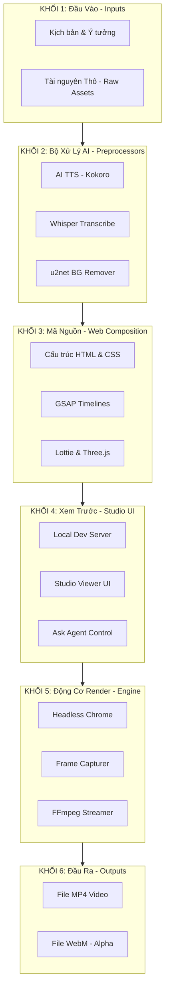

# Kiến Trúc & Quy Trình Hoạt Động (Pipeline) - HeyGen Hyperframes

Tài liệu này mô tả chi tiết và sâu sắc quy trình hoạt động (pipeline) cốt lõi của **HeyGen Hyperframes** – từ chuẩn bị nguyên liệu, thiết lập chuyển động, xem trước thời gian thực cho đến kết xuất thành tệp video vật lý hoàn chỉnh.

---

## 🌟 Triết Lý Cốt Lõi: Tại Sao Lại Là "Hyperframes"?

Trước đây, việc tạo video tự động thường dựa trên các phần mềm đóng kín hoặc các thư viện đồ họa nặng nề. 
**Hyperframes** đi theo một hướng tiếp cận đột phá: *Biến chính Trình duyệt Web (Chromium) – nơi xử lý giao diện HTML/CSS/JS tốt nhất hành tinh – thành một động cơ kết xuất video.*

Tuy nhiên, trình duyệt web thông thường luôn bị giật lag, trễ mạng hoặc tải tài nguyên không đồng đều khi chạy trực tiếp. Hyperframes giải quyết triệt để vấn đề này bằng cơ chế **Tất định (Deterministic Rendering)**. Bất kể bạn kết xuất video trên một chiếc máy tính siêu cấu hình hay một laptop cũ kỹ, video đầu ra luôn giống nhau tuyệt đối từng pixel, âm thanh và chuyển động đồng bộ hoàn hảo 100%.

---

## 🗺️ Sơ Đồ Hệ Thống Từng Khối (Block-by-Block Diagram)

Dưới đây là sơ đồ kiến trúc luồng dữ liệu 6 khối của Hyperframes, đi từ nguyên liệu thô đầu vào đến sản phẩm video hoàn chỉnh ở đầu ra:



---

## 🔄 Giải Thích Luồng Dữ Liệu & Vận Hành Chi Tiết

Quy trình hoạt động của Hyperframes được chia thành **3 Trục xử lý chính** liên hoàn:

### 🛣️ TRỤC 1: TIỀN XỬ LÝ AI (Khối 1 & Khối 2)
Đây là giai đoạn chuẩn bị và tinh chế nguyên liệu thô trước khi đưa vào lập trình giao diện video.

*   **Chuẩn bị tài nguyên:** Người dùng hoặc AI Agent đưa vào kịch bản chữ (Prompt), hình ảnh, clip ngắn và nhạc nền thô.
*   **Chạy mô hình AI cục bộ (Local Model Execution):** Hyperframes tích hợp sẵn các mô hình AI nhỏ nhưng mạnh mẽ chạy trực tiếp trên máy của bạn mà không cần kết nối API ngoài:
    *   **AI TTS (Kokoro):** Nhận văn bản chữ và sinh ra file âm thanh thuyết minh giọng đọc tự nhiên (`.wav`).
    *   **Whisper Transcribe:** Lắng nghe file thuyết minh và bóc tách thành tệp dữ liệu phụ đề dạng `.json` chứa các **mốc thời gian (timestamp)** chính xác ở cấp độ từng từ theo mili-giây.
    *   **u2net BG Remover:** Phát hiện vật thể trong hình ảnh/video thô và tự động xóa nền, tạo ra các file PNG hoặc WebM có kênh alpha (trong suốt) dùng làm lớp phủ hiệu ứng đồ họa nghệ thuật.

### 🎨 TRỤC 2: SÁNG TẠO & LẬP TRÌNH WEB (Khối 3 & Khối 4)
Giai đoạn định hình mỹ thuật và thiết kế kịch bản hoạt ảnh động cho video.

*   **Bố cục Web (HTML/CSS):** Mã nguồn `index.html` chứa cấu trúc hiển thị của video. Mỗi phân cảnh là các thẻ `<div>` lồng nhau. CSS (hoặc Tailwind CSS v4) được sử dụng để căn chỉnh bố cục tỉ mỉ, bo góc, đổ bóng và tạo chiều sâu kính mờ (glassmorphism) đẳng cấp cao.
*   **Dòng thời gian tất định (GSAP Timelines):** 
    *   Mọi hoạt ảnh (chữ bay, ảnh phóng to, chuyển động camera) đều được kiểm soát bởi thư viện **GSAP** và được đăng ký trực tiếp vào dòng thời gian toàn cục: `window.__timelines["main"] = tl`.
    *   *Quy tắc bất biến:* Không sử dụng các hàm bất tuần tự trôi nổi như `setTimeout`, `requestAnimationFrame`, `Math.random()`, hay `Date.now()`. Tất cả mọi thay đổi trạng thái hình ảnh phải được ánh xạ chính xác tuyệt đối vào dòng thời gian của timeline.
*   **Bản xem trước trực quan (Studio UI):** Lệnh `npm run dev` khởi tạo máy chủ cục bộ và mở giao diện **Hyperframes Studio**. Người dùng có thể kéo thanh timeline để kiểm tra hoạt ảnh hoặc sử dụng tính năng **"Ask agent"** để điều chỉnh màu sắc, văn bản bằng ngôn ngữ tự nhiên thông qua AI Agent hỗ trợ.

### ⚙️ TRỤC 3: ĐỘNG CƠ KẾT XUẤT TẤT ĐỊNH (Khối 5 & Khối 6)
Giai đoạn ma thuật: Đóng băng thời gian trên trang web động và biến chuỗi trạng thái thành tệp video vật lý.

Khi chạy lệnh `npx hyperframes render`, động cơ sẽ khởi chạy trình duyệt Chromium chạy ngầm (Headless Chrome) và thực hiện các bước sau:

1.  **Cơ chế tua & chụp (Seek-driven Chromium Capture):**
    *   Trình duyệt ẩn **không chạy video theo thời gian thực (real-time)**. Để triệt tiêu hoàn toàn độ trễ phần cứng hay nghẽn mạng, trình kết xuất sẽ ép dòng thời gian trang web đứng yên và dịch chuyển từng bước cực nhỏ:
        *   Tua timeline web đến giây `0.000` -> Chờ trình duyệt vẽ xong -> Chụp ảnh màn hình chất lượng gốc (Frame 1).
        *   Tua timeline web đến giây `0.033` (mốc 30fps) -> Đợi vẽ xong -> Chụp ảnh màn hình (Frame 2).
        *   Tua timeline web đến giây `0.066` -> Chụp ảnh màn hình (Frame 3).
    *   Nhờ cơ chế tua và chụp tĩnh này, hoạt ảnh xuất ra luôn mượt mà 100%, không bao giờ có hiện tượng giật khung hình hay lệch tiếng.
2.  **Đóng gói FFmpeg Streamer:** Các khung ảnh được truyền trực tiếp vào bộ đệm của **FFmpeg**. FFmpeg sẽ tiến hành ghép các file âm thanh thuyết minh sinh từ bước AI vào đúng vị trí dòng thời gian và nén lại thành tệp đầu ra:
    *   **MP4 Video:** Video chất lượng cao hoàn chỉnh.
    *   **WebM (Alpha Channel):** Video nền trong suốt dùng để đè lên các nền tảng video khác làm hiệu ứng VFX.

---

## 💎 Các Ưu Điểm Vượt Trội Của Hệ Thống

*   **Tính cá nhân hóa quy mô lớn (Dynamic Variables):** Bạn chỉ cần lập trình bố cục HTML một lần. Khi cần kết xuất hàng loạt video cho hàng ngàn khách hàng khác nhau, bạn chỉ cần truyền biến số thông qua câu lệnh:
    ```bash
    npx hyperframes render --variables '{"customerName": "Khách hàng A", "discountCode": "KM20"}'
    ```
*   **Thân thiện với AI Agents:** Lập trình viên AI dễ dàng đọc hiểu cấu trúc DOM và thao tác tự động thay đổi video nhanh chóng thông qua mã nguồn mở thân thiện, loại bỏ hoàn toàn rào cản của các phần mềm chỉnh sửa video đóng.
*   **Chất lượng sắc nét tuyệt đối (Pixel-Perfect):** Không bị suy hao hay nén mờ qua các khâu trung gian, video MP4 xuất ra luôn giữ đúng độ phân giải gốc của trình duyệt.
